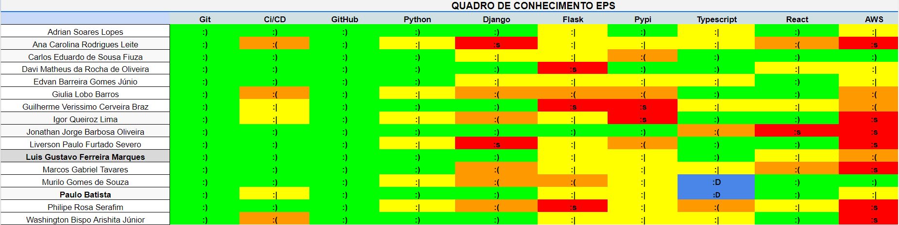
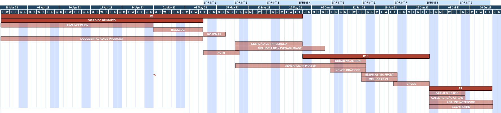

# Agendas de Trabalho e Ferramentas 

## Histórico de versão

|        Data         |      Autor       |                  Descrição da revisão                  | Versão |
| :----------------:  | :--------------: | :----------------------------------------------------: | :----: |
| 15 de Maio de 2023  | **Davi Matheus** |                Inclusão da documentação                | 1.0.0  |
| 19 de Maio de 2023  | **Adrian Soares**|              Inclusão do gráfico de Gantt              | 1.0.1  |

## Objetivo do documento

Esse documento tem como objetivo principal descrever, organizar e acompanhar as tarefas e compromissos relacionados ao nosso projeto de forma clara e estruturada. Além disso, busca fornecer informações detalhadas sobre as ferramentas específicas que serão utilizadas, incluindo suas funcionalidades, recursos e instruções de uso.

É essencial documentar e manter a equipe atualizada acerca das mudanças nas agendas de trabalho ou nas ferramentas utilizadas. Isso possibilita a comunicação efetiva entre os membros da equipe, permitindo que todos estejam alinhados em relação às responsabilidades, prazos e atualizações do projeto.

Neste documento estrão presentes os artefatos do timebox do projeto, um Quadro de disponibilidade e de conhecimentos da equipe, suas ferramentas utilizadas e um por fim Quadro de Gantt.

Em suma, ao detalhar de forma precisa as tarefas, compromissos e ferramentas utilizadas, e ao manter a equipe informada sobre as alterações pertinentes, o documento de agenda de trabalho e de ferramentas contribui para a organização, comunicação e sucesso do projeto.

## Timebox 

Um timebox é um intervalo de tempo limitado e predefinido durante o qual uma atividade ou conjunto de atividades deve ser executado. Essa técnica ajuda a promover eficiência, foco e disciplina, facilitando a gestão do tempo e a entrega de resultados em projetos e métodos ágeis.

Time box utilizado pela equipe :

| Dias | Horário | Reunião |
| :--------: | :--------: | :--------: |
| Segunda    | 19:00 - 20:00 | Reunião com o Cliente |
| Segunda     | 20:10 - 21:10 | Planning |
| Terça e Quinta | 13:00 - 14:00 | Alinhamento da Equipe |

## Quadro de Conhecimentos

## Grade Horária 

## Ferramentas utilizadas

|  Ferramenta | Propósito |
|  :--------: | :--------: |
| Discord | Comunicações assíncronas com cliente / Comunicações internas e registro de informações. / Pareamentos |
| Telegram | Comunicação assíncrona entre o time |
| Zenhub | Ferramenta de acompanhamento do projeto (Kanban, Roadmap, Issues e Sprints) |
|  Teams | Reuniões síncronas com o Cliente / Reuniões internas |
| Github | Repositórios de documentação e código do projeto |

##  Quadro de Gantt

Roadmap estabelecido com base na EAP e as principais entregas para a disciplina. Também são mostradas as Sprints com duração de 7 dias. Os tempos em vermelho mais escuro representam as entregas de maior significância.

