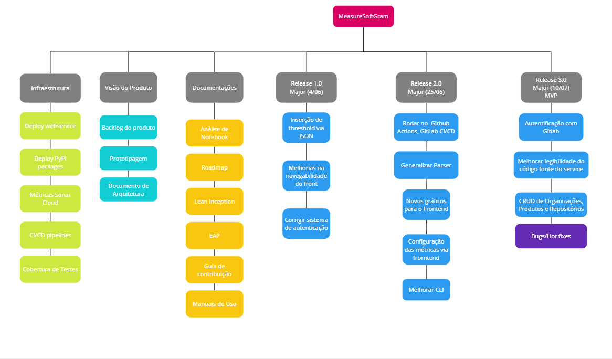

## Histórico de Versões

Data|Versão|Descrição|Autor(es)
-|-|-|-
26/05/2023|1.0| Criação do documento |Guilherme Braz, Murilo Gomes e Giulia Lobo|

## Introdução

&emsp;&emsp;
  A Estrutura Analítica do Projeto, mais conhecida como EAP, é um instrumento eficaz para a gestão do escopo de um projeto. Apresentada de forma hierárquica e visual, a EAP é essencialmente um diagrama que divide o escopo total do projeto em partes menores e mais manejáveis, facilitando assim o controle das entregas. No topo da estrutura, está o objetivo final do projeto, que é então subdividido em níveis cada vez mais específicos de tarefas e sub-tarefas necessárias para alcançar esse objetivo. A natureza visual e estruturada da EAP é benéfica para os times, pois ajuda no planejamento, na compreensão do escopo geral do projeto e na identificação das partes que compõem o todo, promovendo assim um gerenciamento de projeto mais eficiente e efetivo[<a href=./#referencias>1</a>][<a href=./#referencias>2</a>][<a href=./#referencias>3</a>][<a href=./#referencias>4</a>].

## Metodologia

&emsp;&emsp; 
Este documento foi cuidadosamente elaborado seguindo as diretrizes centrais do <a href="https://github.com/fga-eps-mds/A-Disciplina-MDS-EPS/blob/master/PlanosDeEnsino/EPS_Plano_de_Ensino.md">plano de ensino</a> da disciplina Engenharia do Produto de Software (EPS), conforme disponibilizado no repositório do Prof. Hilmer Rodrigues Neri. O propósito primordial deste documento é estabelecer as hierarquias de alto nível designadas para cada etapa do projeto, facilitando assim a orientação para as entregas de cada release.

## Resultados

## Referências

> [1] EAP - Artia. Disponível em [https://artia.com/blog/como-fazer-eap-na-gestao-de-projetos/](https://artia.com/blog/como-fazer-eap-na-gestao-de-projetos/)

> [2] WBS - IBM. Disponível em [https://www.ibm.com/docs/en/mea/761?topic=SSXB7Z_7.6.1/com.ibm.meaora.doc/sag/c_ctr_oraclepa_proj_task_integ.html](https://www.ibm.com/docs/en/mea/761?topic=SSXB7Z_7.6.1/com.ibm.meaora.doc/sag/c_ctr_oraclepa_proj_task_integ.html)

> [3] EAP - EUAX. Disponível em [https://www.euax.com.br/2018/12/eap-estrutura-analitica-projeto/](https://www.euax.com.br/2018/12/eap-estrutura-analitica-projeto/)

> [4] Estrutura Analítica do Projeto - CAE Treinamentos. Disponível em [https://caetreinamentos.com.br/blog/carreira/o-que-e-eap/](https://caetreinamentos.com.br/blog/carreira/o-que-e-eap/)

> [5] EAP - Artia. Disponível em [https://artia.com/blog/como-fazer-eap-na-gestao-de-projetos/](https://artia.com/blog/como-fazer-eap-na-gestao-de-projetos/)