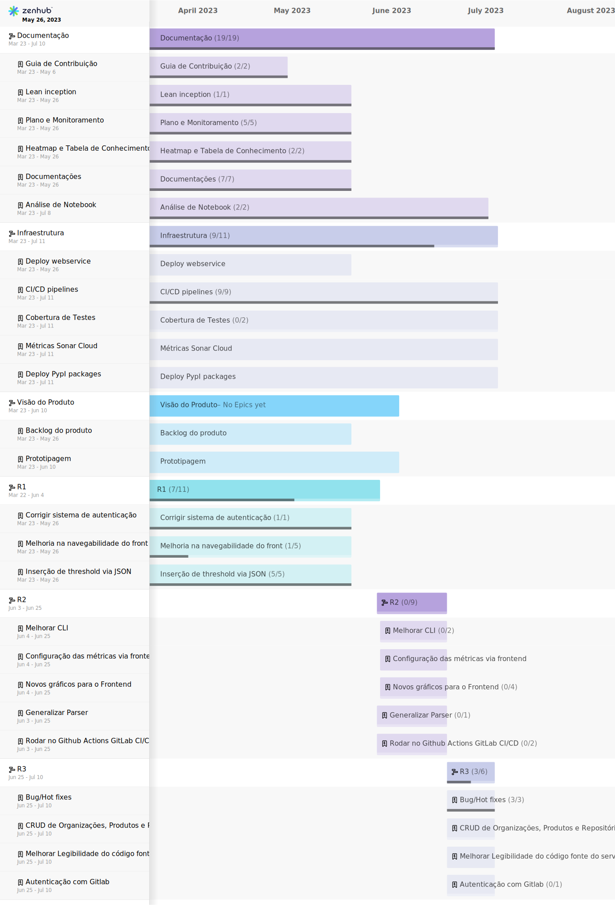

# RoadMap

## Histórico de versão

|        Data        |                      Autor                      |      Descrição da revisão       | Versão |
| :----------------: | :---------------------------------------------: | :-----------------------------: | :----: |
| 26 de Maio de 2023 | **Davi Matheus, Guilherme Braz e Luis Marques** |    Inclusão da documentação     | 1.0.0  |
| 26 de Maio de 2023 | **Davi Matheus, Guilherme Braz e Luis Marques** | Inclusão de descrição e imagens | 1.1.0  |

# Introdução

&emsp;&emsp;
Um roteiro de produto, ou "product roadmap", é um plano de ação que esboça a visão, direção, prioridades e progresso de um produto ao longo do tempo. É uma fonte compartilhada de verdade que alinha a organização em torno de metas de curto e longo prazo para o produto ou projeto e como elas serão alcançadas. O roteiro de produto é essencial para comunicar como os esforços de curto prazo se alinham aos objetivos de negócios de longo prazo. Ele serve a uma variedade de públicos, incluindo a equipe de desenvolvimento, executivos, vendas e clientes. Além disso, o roteiro de produto deve ser atualizado regularmente para refletir as mudanças no cenário competitivo, nas preferências dos clientes ou nas funcionalidades planejadas.[<a href=./#referencias>1</a>][<a href=./#referencias>2</a>].

## Roadmap de todo o projeto

No nosso roadmap, organizamos o trabalho em diferentes projetos para garantir uma visão clara e estruturada do que precisa ser feito. Cada projeto representa uma área de foco principal e contém vários épicos, que são grandes blocos de trabalho que podem ser divididos em histórias de usuário mais gerenciáveis. Aqui está uma visão geral de como os projetos estão estruturados:

1. **Documentação**: Este projeto abrange todos os aspectos relacionados à criação e manutenção da documentação do produto. Os épicos podem incluir a criação de manuais do usuário, documentação técnica, FAQs, entre outros.

2. **Infraestrutura**: Este projeto é dedicado à configuração e manutenção da infraestrutura necessária para o desenvolvimento e operação do produto. Os épicos podem envolver a configuração de servidores, manutenção de bancos de dados, implementação de segurança, etc.

3. **Visão do Produto**: Este projeto aborda a estratégia e planejamento do produto. Os épicos podem incluir pesquisa de mercado, definição de persona, planejamento de recursos, etc.

4. **Release 1, 2, e 3**: Estes projetos são dedicados a diferentes versões do produto. Cada release tem seus próprios épicos, que são grandes blocos de trabalho que contribuem para o lançamento. Cada épico, por sua vez, é dividido em histórias de usuário, que são tarefas específicas que precisam ser concluídas para realizar o épico.

Cada história de usuário dentro de um épico representa uma funcionalidade ou melhoria específica que contribui para o objetivo geral do épico. As histórias de usuário são atribuídas a membros individuais da equipe para desenvolvimento e são monitoradas ao longo do tempo para garantir que o trabalho esteja progredindo conforme planejado.

Essa estrutura de roadmap nos permite manter um foco claro em nossos objetivos, priorizar efetivamente nosso trabalho e garantir que todos na equipe entendam o que precisa ser feito.

## Roadmap somente da Release 1

Abaixo foi realizado um recorte do roadmap geral, focando apenas na release 1.

## Referências

> [1] </b>BREE, Davies. Product Roadmap Guide: What is it & How to Create One.</b> Disponível em: https://www.atlassian.com/agile/product-management/product-roadmaps . Acesso em 26 de maio de 2023

> [2] </b> Product Plan. The Ultimate Guide to Product Roadmaps</b> Disponível em: https://www.productplan.com/learn/what-is-a-product-roadmap/ . Acesso em 26 de maio de 2023
