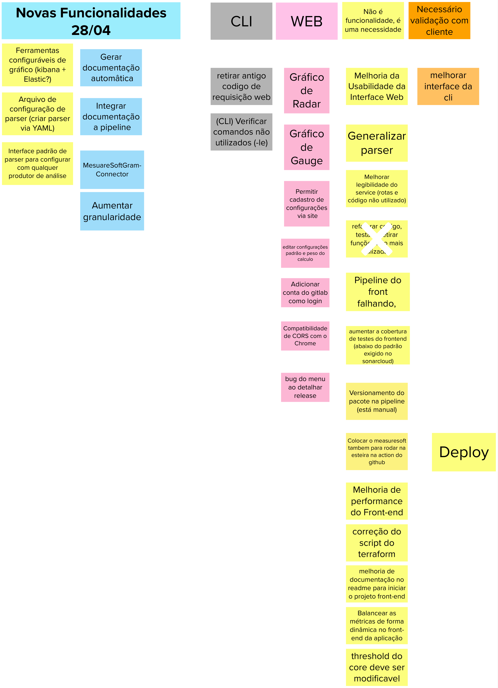

# Brainstorming de Funcionalidades

## Histórico de versão

|        Data        |       Autor       |                  Descrição da revisão                  | Versão |
| :----------------: | :---------------: | :----------------------------------------------------: | :----: |
| 25 de Maio de 2023  | **Davi Matheus**  |                Inclusão da documentação                | 1.0.0  |

## Introdução

Uma funcionalidade é uma representação de uma ação ou interação que um usuário realiza com o produto. Ela pode incluir ações como imprimir uma nota fiscal, consultar um extrato detalhado ou convidar amigos do Facebook. Ao descrever uma funcionalidade, é essencial manter a simplicidade, com o objetivo de atender a um objetivo de negócio, satisfazer uma necessidade específica da persona ou abordar um passo importante da jornada do usuário. Dessa forma, garantimos que as funcionalidades sejam claras, relevantes e contribuam para uma experiência significativa com o produto.

Desse modo, o que buscamos com o brainstorming de funcionalidades é identificar, de acordo com as personas estabelecidas, as funcionalidades que satisfazem as necessidades da persona e os objetivos do produto. 

## Metodologia

Para elaborar o artefato, cada membro do grupo realizou uma reflexão individual para levantar funcionalidades, que foram posteriormente compiladas em um único artefato, eliminando duplicações e funcionalidades desnecessárias. Essa abordagem permitiu obter uma visão geral das funcionalidades desejadas pelos usuários do projeto e que ainda não foram implementadas em outras interações do produto, evitando redundâncias e assegurando a precisão das informações coletadas.

## Resultado do Brainstorm

## Referências

> [1] <b> Lean Inception, </b>. Disponível em:  https://www.caroli.org/atividade-escrevendo-colaborativamente-a-visao-do-produto/
 .Acesso em: 25 de Maio de 2023

