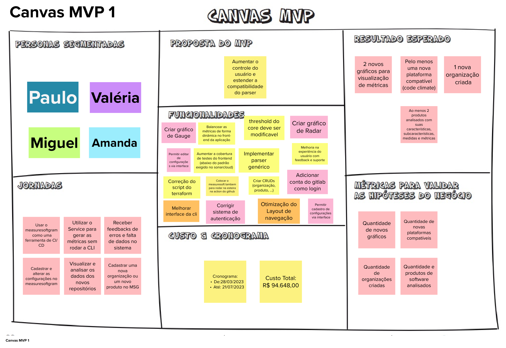

# Brainstorming de Funcionalidades

## Histórico de versão

|        Data        |       Autor       |                  Descrição da revisão                  | Versão |
| :----------------: | :---------------: | :----------------------------------------------------: | :----: |
| 25 de Maio de 2023  | **Davi Matheus**  |                Inclusão da documentação                | 1.0.0  |

## Introdução 

O Canvas MVP é uma ferramenta visual essencial que auxilia a equipe a alinhar e definir a estratégia do MVP (Produto Mínimo Viável). O MVP representa a versão mais simples do produto que pode ser disponibilizada para o negócio, mantendo a funcionalidade necessária para ser efetivamente utilizado e validado pelo usuário final. O uso do Canvas MVP facilita o planejamento e a identificação dos elementos essenciais do produto, garantindo que o produto viável atenda às necessidades do negócio e dos usuários.

## Metodologia

Após a definição do MVP, empregamos um quadro para apresentar tudo o que foi concebido (canvas MVP). Esse quadro é subdividido em 7 seções, cada uma encarregada de conter informações como: 

        Proposta do MVP
        Personas
        Jornadas 
        Funcionalidades
        Resultados esperados
        Métricas para validar as hipóteses do negócio
        Estimativa de custos e Cronograma. 

Seguindo as orientações para a elaboração do canvas, a equipe se reuniu, utilizando os artefatos gerados nas etapas anteriores ao canvas. Com isso, foi possível criar o quadro, apresentado abaixo:

## Resultado

### Personas Segmentadas

- Paulo
- Valéria
- Miguel
- Amanda

### Proposta do MVP

- Aumentar o controle do usuário e estender a compatibilidade do parser

###  Resultado esperado

- 2 novos gráficos para visualização de métricas
- Pelo menos uma nova plataforma compatível (code climate)
- 1 nova organização criada
- Ao menos 2 produtos analisados com suas características, subcaracterísticas, medidas e métricas

### Jornadas

- Usar o measuresoftgram como uma ferramenta de CI/CD
- Utilizar o Service para gerar as métricas sem rodar a CLI
- Receber feedbacks de erros e falta de dados no sistema
- Cadastrar e alterar as configurações no measuresoftgram
- Visualizar e analisar os dados dos novos repositórios
- Cadastrar uma nova organização ou um novo produto no MSG

### Funcionalidades

- Criar gráfico de Gauge
- Balancear as métricas de forma dinâmica no front-end da aplicação
- Threshold do core deve ser modificavel
- Criar gráfico de Radar
- Permitir editar de configurações via interface
- Aumentar a cobertura de testes do frontend (abaixo do padrão exigido no sonarcloud)
- Implementar parser genérico
- Melhoria na experiência do usuário com feedback e suporte
- Correção do script do terraform
- Colocar o measuresoft tambem para rodar na esteira na action do github
- Criar CRUDs (organização, produto, ...)
- Adicionar conta do gitlab como login
- Melhorar interface da cli
- Corrigir sistema de autenticação
- Otimização do Layout de navegação
- Permitir cadastro de configurações via interface

### Métricas para validar as hipóteses do negócio

- Quantidade de novos gráficos
- Quantidade de novas plataformas compatíveis   
- Quantidade de organizações criadas
- Quantidade e produtos de software analisados

### Custo e Cronograma

- Custo Total:R$ 94.648,00
- Cronograma:
 * De:28/03/2023
 * Até: 21/07/2023

