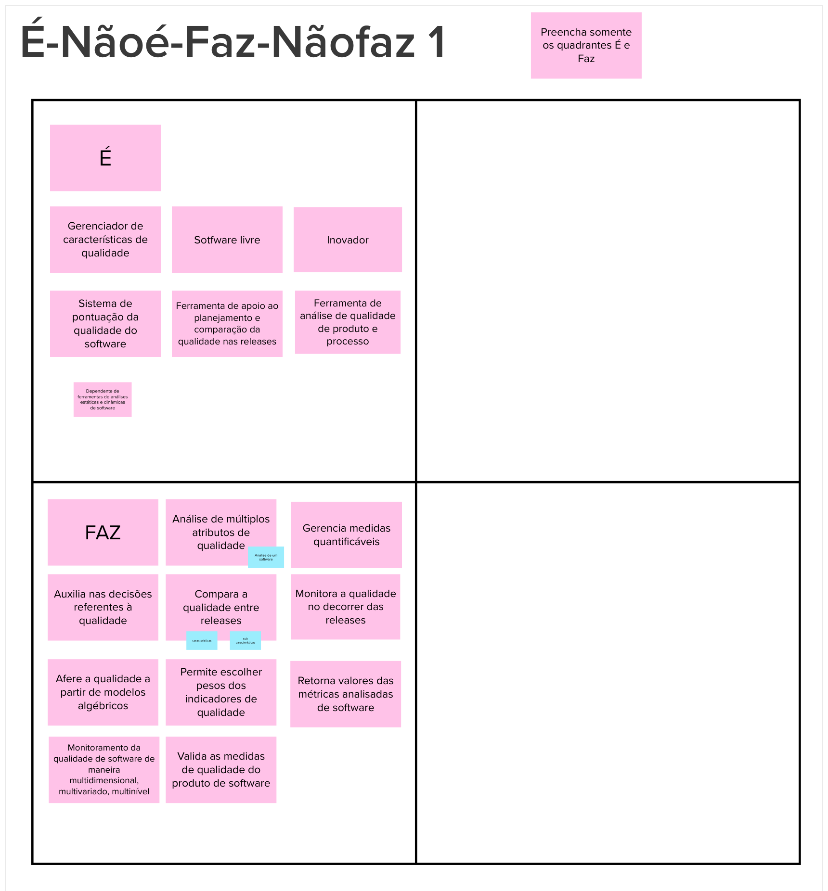
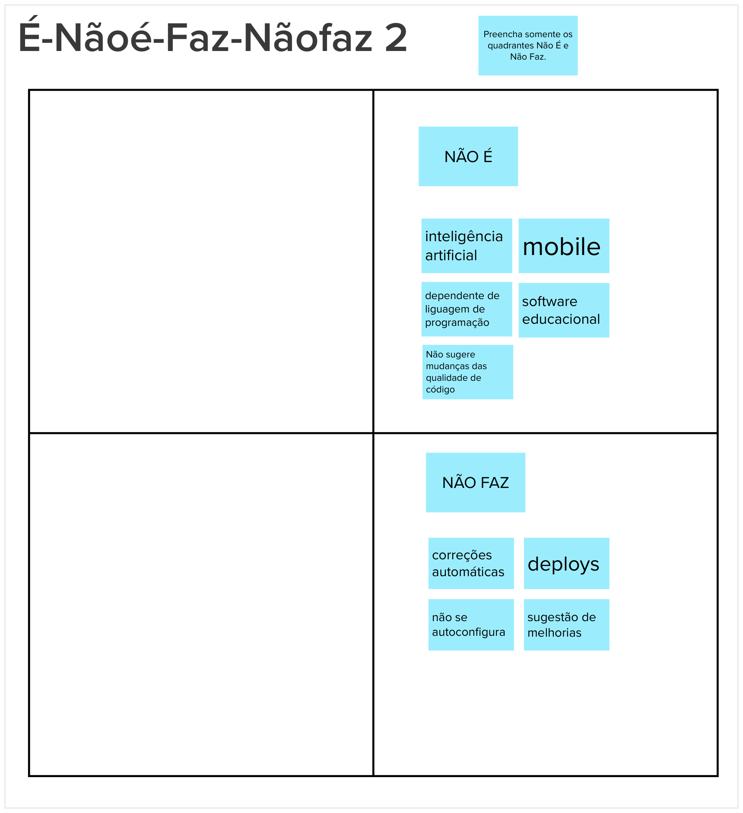

# É, Não É, Faz, Não Faz

## Histórico de versão

|        Data        |      Autor       |   Descrição da revisão   | Versão |
| :----------------: | :--------------: | :----------------------: | :----: |
| 24 de Maio de 2023 | **Davi Matheus** | Inclusão da documentação | 1.0.0  |

## Introdução

Em determinadas circunstâncias, descrever o que algo não é ou não faz pode ser uma abordagem mais fácil. Nessa atividade, o objetivo é classificar o produto com base em quatro diretrizes, examinando minuciosamente os aspectos positivos e negativos relacionados à sua capacidade de ser ou realizar uma determinada função.

## Resultados

### Quadro É

### Quadro Não É

## Referências

> [1] <b> Lean Inception, "É, Não É, Faz, Não Faz"</b>. Disponível em: https://www.caroli.org/e-nao-e-faz-nao-faz/.Acesso em: 24 de Maio de 2023