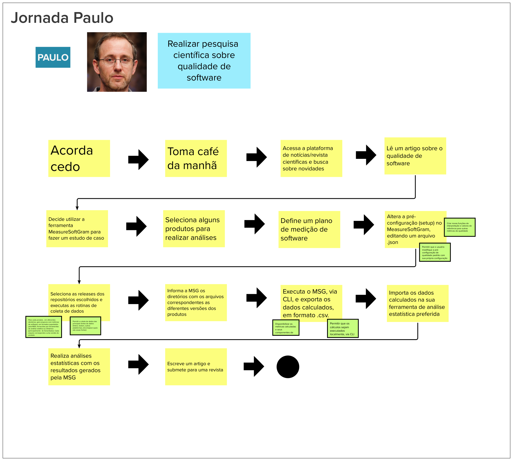
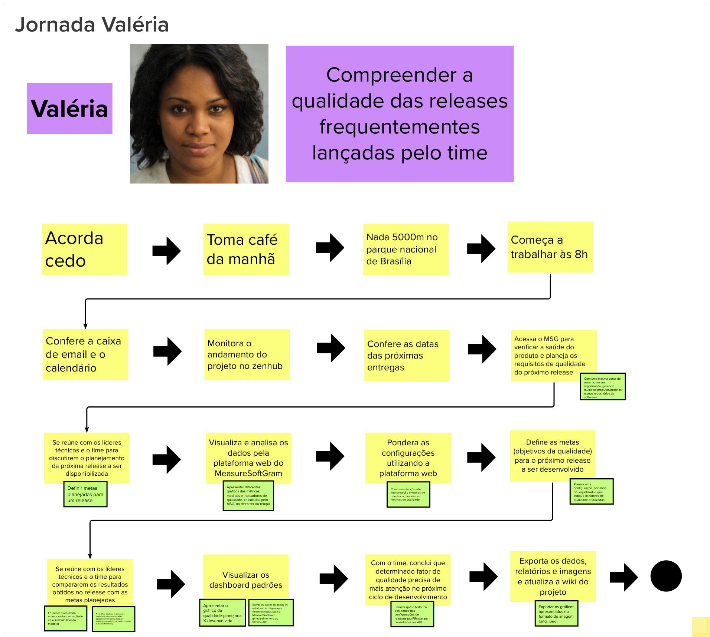
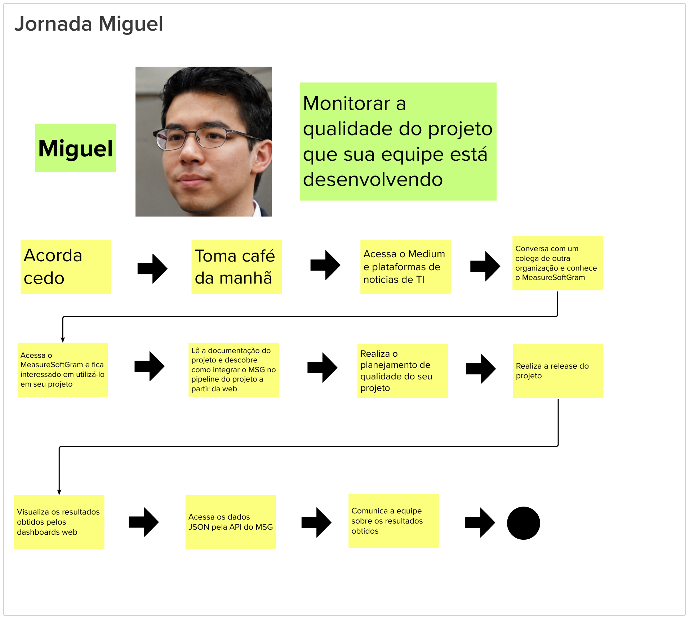
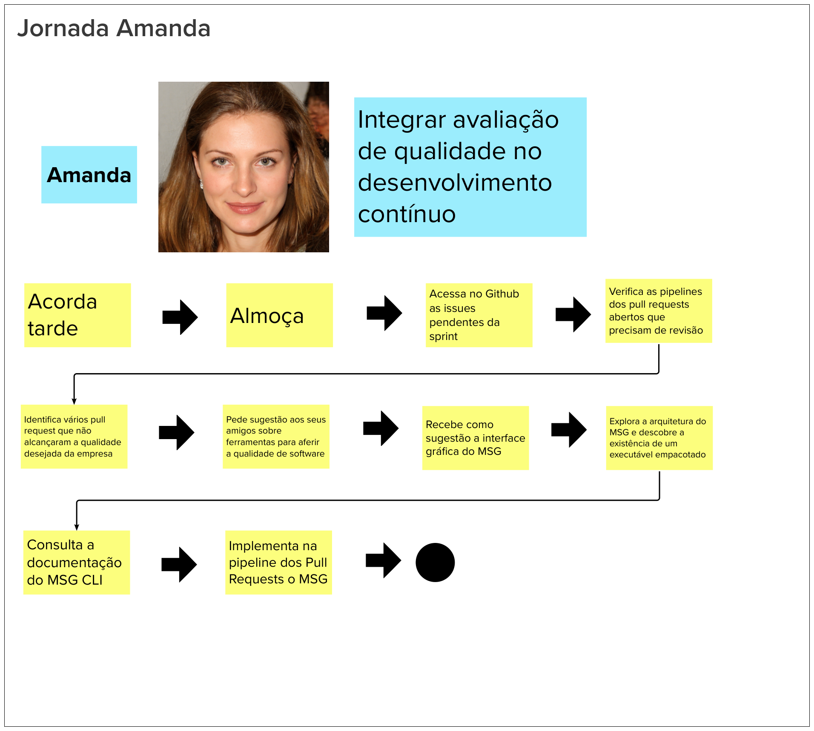

# Jornada de Usuário

## Histórico de versão

|        Data        |       Autor       |                  Descrição da revisão                  | Versão |
| :----------------: | :---------------: | :----------------------------------------------------: | :----: |
| 25 de Maio de 2023  | **Davi Matheus**  |                Inclusão da documentação                | 1.0.0  |

## Introdução

A jornada do usuário retrata o caminho percorrido por um indivíduo ao seguir uma sequência de passos para alcançar um objetivo específico. Durante essa trajetória, ocorrem interações entre a pessoa e o produto em diversos pontos de contato. 

O propósito dessa etapa é representar visualmente as etapas do relacionamento do cliente com o produto, criando um cenário (jornada) no qual o usuário desempenha ações ao longo de todo o processo de utilização do serviço ou produto. Essa abordagem permite mapear todos os pontos de contato do usuário e construir uma história na qual ele se torna o protagonista.

## Metodologia 

Dividimos a equipe em três grupos, e cada um deles foi encarregado de descrever uma jornada. Em seguida, cada grupo apresentou sua respectiva jornada para toda a equipe. O objetivo dessa dinâmica é proporcionar uma visão abrangente das diferentes jornadas dos usuários, destacando os pontos de contato e interações com o produto. O processo pode ser repetido opcionalmente, realizando mais rodadas para descrever outras jornadas relevantes. Isso permite uma compreensão mais completa das experiências dos usuários e auxilia na identificação de possíveis melhorias ou oportunidades para aprimorar o produto.

- É importante direcionar nosso foco para a seguinte pergunta:

        Qual objetivo a persona quer alcançar? 

* Dada a criação de personas na etapa anterior do Lean Inception, aproveitamos essa oportunidade para desenvolver nossa jornada do usuário em torno delas.

## Resultados

Ao seguir os passos estabelecidos, o grupo levantou as seguintes jornadas.

### Jornada do Paulo

### Jornada da Valéria

### Jornada do Miguel

### Jornada da Amanda

## Referências

> [1] <b> Lean Inception, </b>. Disponível em:  https://www.caroli.org/usm-e-direto-ao-ponto/ .Acesso em: 25 de Maio de 2023

