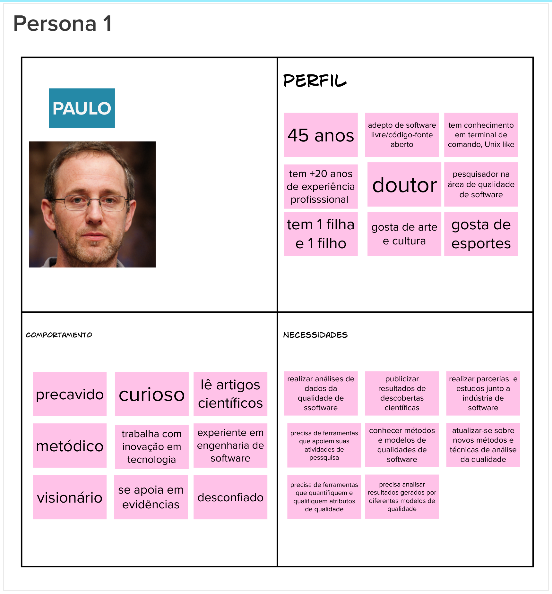
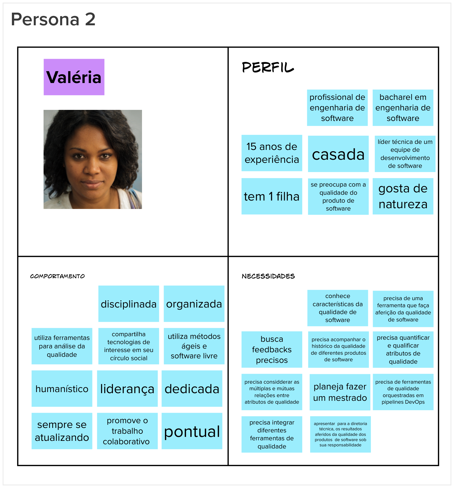
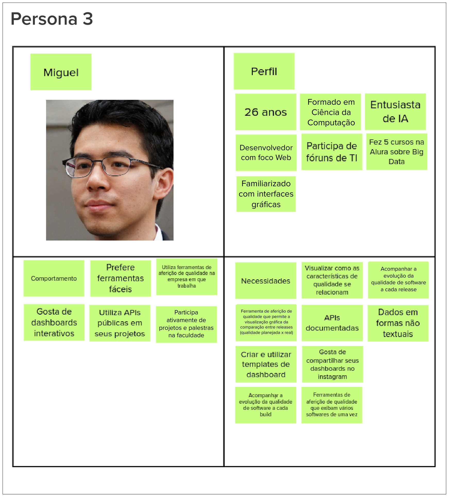
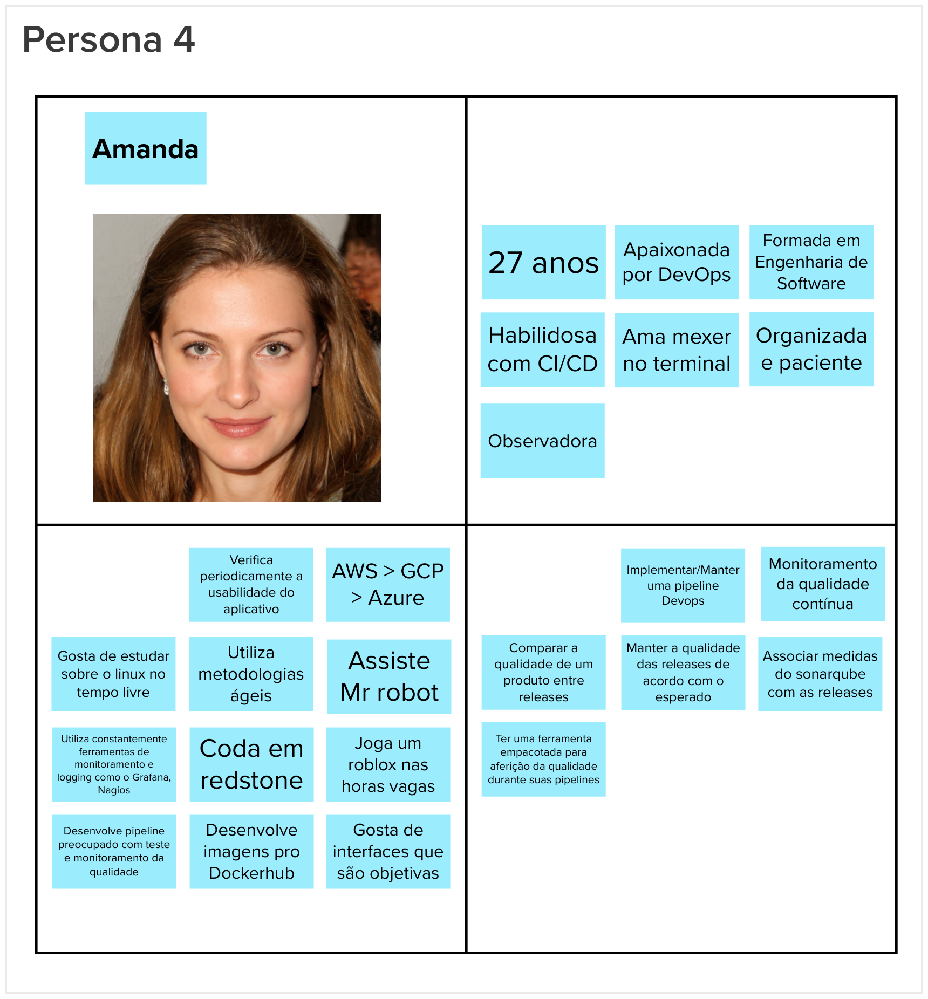

# Personas

## Histórico de versão

|        Data        |       Autor       |                  Descrição da revisão                  | Versão |
| :----------------: | :---------------: | :----------------------------------------------------: | :----: |
| 24 de Maio de 2023  | **Davi Matheus**  |                Inclusão da documentação                | 1.0.0  |

## Introdução

A fim de identificar de forma eficaz as funcionalidades de um produto, é fundamental levar em consideração os usuários e seus objetivos. A elaboração de uma persona proporciona uma representação realista dos usuários, permitindo que a equipe descreva as funcionalidades sob a perspectiva daqueles que irão interagir com o produto final de maneira significativa.

        Uma persona representa um usuário do produto, descrevendo não só o seu papel, mas também características e necessidades.

## Metodologia

Durante a atividade, a equipe foi dividida em três grupos distintos, sendo que cada grupo ficou responsável por elaborar a descrição de uma persona. Em seguida, cada grupo apresentou sua persona para toda a equipe. Caso haja necessidade, podem ser realizadas mais rodadas para descrever outras personas. Após cada rodada, as personas podem ser agrupadas por similaridade.

## Resultados

Ao seguir os passos estabelecidos, o grupo levantou as seguintes personas.

### Persona 1

### Persona 2

### Persona 3

### Persona 4

