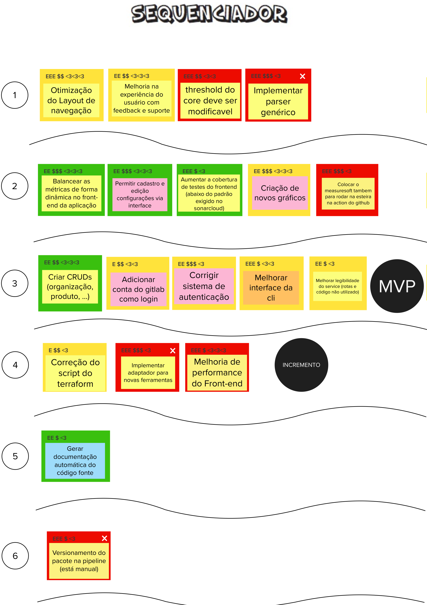

# Sequenciador

## Histórico de versão

|        Data        |       Autor       |                  Descrição da revisão                  | Versão |
| :----------------: | :---------------: | :----------------------------------------------------: | :----: |
| 25 de Maio de 2023  | **Davi Matheus**  |                Inclusão da documentação                | 1.0.0  |

## Introdução 

O Sequenciador de funcionalidades desempenha um papel fundamental ao auxiliar na organização e visualização das funcionalidades, bem como na sequência de validação incremental do produto. Sua utilização facilita o planejamento estratégico e proporciona uma visão clara do desenvolvimento do produto ao longo do tempo.

## Metodologia 

O sequenciador possui regras padrão, no entanto, devido ao grande número de funcionalidades propostas em nosso projeto, adaptamos essas regras. Por exemplo, enquanto o número máximo de cartões padrão seria de 3, no nosso caso, optamos por ter 6 cartões. Essas alterações foram feitas em diálogo e em concordância com nosso cliente, garantindo que as necessidades e objetivos específicos do projeto sejam atendidos de forma adequada.

### Regras Adaptadas

            Regra 1:
            Uma onda pode conter no máximo seis, cartões.
            Regra 2:
            Uma onda não pode conter mais de dois cartões vermelho.
            Regra 3:
            Uma onda não pode conter seis cartões somente amarelos ou vermelho.
            Regra 4:
            A soma de esforço dos cartões não pode ultrapassar doze Es.
            Regra 5:
            A soma de valor dos cartões não pode ser menos de oito $s e oito corações.
            Regra 6:
            Se um cartão depende de outro, esse outro deve estar em alguma onda anterior.

## Resultados 

Após inúmeras reuniões e tentativas, finalmente conseguimos transcrever de forma adequada nossas funcionalidades para o sequenciador. Apresentamos abaixo o resultado final do nosso sequenciador:

## Referências

> [1] <b> [Sequenciador] Como Ordenar e Priorizar </b>. Disponível em: https://www.caroli.org/sequenciador/ .Acesso em: 25 de Maio de 2023

