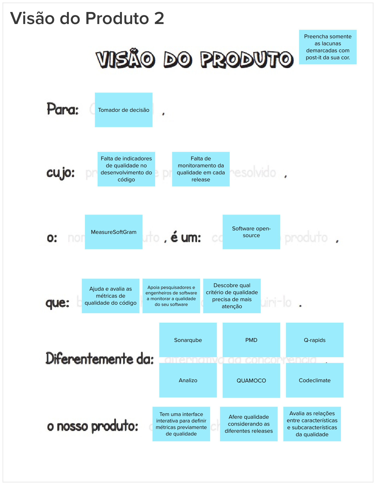

# Visão do Produto

## Histórico de versão

|        Data        |       Autor       |                  Descrição da revisão                  | Versão |
| :----------------: | :---------------: | :----------------------------------------------------: | :----: |
| 24 de Maio de 2023  | **Davi Matheus**  |                Inclusão da documentação                | 1.0.0  |

## Introdução

A etapa da visão do produto no Lean Inception desempenha um papel crucial na definição inicial do produto, fornecendo um processo estruturado para estabelecer uma visão abrangente e ponderar sobre o seu valor. 

Durante essa etapa, a equipe trabalha em conjunto de forma colaborativa, seguindo um template específico, com o objetivo de criar uma visão clara e compartilhada do produto em desenvolvimento.

## Metodologia

Ao seguir os passos estabelecidos, cada grupo conseguiu desenvolver três visões de produtos distintas.

- Divida a equipe em três grupos e solicite que cada grupo preencha apenas as lacunas selecionadas em seu template correspondente.

- Solicite a cada grupo que leia a lacuna preenchida por eles e copie seus post-its para o template consolidado.

- Solicite à equipe que, no Canvas 1, unifique e aprimore as anotações anteriores, a fim de criar uma frase coesa e alinhada que represente de maneira completa a visão consensual do produto.

**TEMPLATE** 

    Para [cliente final]

    O [nome do produto]

    É um [categoria do produto]

    Que [benefício chave, razão para adquiri-lo].

    Diferentemente da [alternativa da concorrência],

    O nosso produto [diferença chave].

## Resultados

### Visão Produto 1

### Visão Produto 2

### Visão Produto 3

## Referências

> [1] <b>Write the Product Vision</b>. Disponível em: < [https://martinfowler.com/articles/lean-inception/write-product-vision.html](https://martinfowler.com/articles/lean-inception/write-product-vision.html) > Acesso em: 24 de Maio de 2023