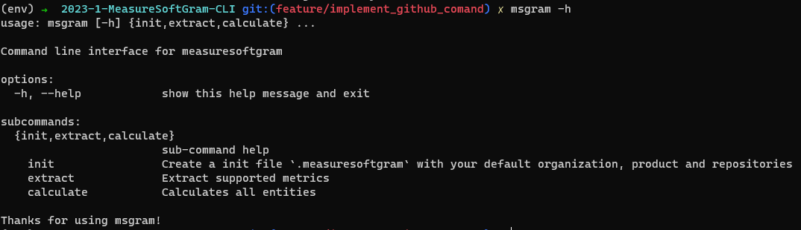
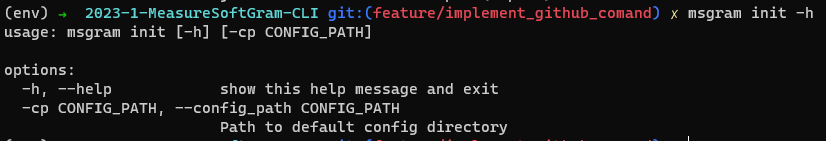

## 1. Versionamento

|Versão|Data|Descrição|Autor(es)|
|------|----|---------|-------- |
|0.1   | 23/05/2023 | Criação do documento | Jonathan e Marcos |
|0.2   | 26/05/2023 | Revisão do documento | Paulo Batista |

## 2. Manual de Uso da `CLI`

### 2.1 O que é o microsserviço `CLI`

<p align="justify" style="text-indent: 20px">
    Esse microsserviço dentro do produto MeasureSoftGram se trata da interface de linha de comandos, que utiliza o pacote de cálculos da Core por trás dos panos, para gerar análises de qualidade dos repositórios. Se trata de um pacote <a href="https://pypi.org/project/msgram/">Pypi</a> totalmente independente, que tem como foco a utilização local (sem necessidade de internet).
</p>

### 2.2 Como executar a `CLI`

<p align="justify" style="text-indent: 20px">
    Para iniciar a utilização da CLI, baixe o pacote do repositório <a href="https://pypi.org/project/msgram/">Pypi</a>.
</p>

```sh
pip install msgram
```

<p align="justify" style="text-indent: 20px">
    Agora todas as funcionalidades disponíveis da CLI do MeasureSoftGram estão disponíveis pelo seguinte comando: msgram
</p>

```sh
msgram -h
```



### 2.3 Comandos existentes na `CLI`

<p align="justify" style="text-indent: 20px">
    Como demonstrado na foto anterior, a CLI do MeasureSoftGram possui três comandos:
</p>

#### 2.3.1 msgram init

<p align="justify" style="text-indent: 20px">
    Responsável por inicializar os arquivos e pastas de configuração que são utilizados nos comandos seguintes. O arquivo <b>msgram.json</b> de configuração das entidades é criado nessa etapa.
</p>

``` sh
msgram init -h
```

<center>



</center>

Exemplo de configuração de qualidade gerado pelo <b>init</b>:

``` json
{
    "characteristics": [
        {
            "key": "reliability",
            "weight": 50,
            "subcharacteristics": [
                {
                    "key": "testing_status",
                    "weight": 100,
                    "measures": [
                        {
                            "key": "passed_tests",
                            "weight": 33
                        },
                        {
                            "key": "test_builds",
                            "weight": 33
                        },
                        {
                            "key": "test_coverage",
                            "weight": 34
                        }
                    ]
                }
            ]
        },
        {
            "key": "maintainability",
            "weight": 50,
            "subcharacteristics": [
                {
                    "key": "modifiability",
                    "weight": 100,
                    "measures": [
                        {
                            "key": "non_complex_file_density",
                            "weight": 33
                        },
                        {
                            "key": "commented_file_density",
                            "weight": 33
                        },
                        {
                            "key": "duplication_absense",
                            "weight": 34
                        }
                    ]
                }
            ]
        }
    ],
    "thresholds":{
     "max_complex_files_density":10,
     "min_comment_density":50,
     "max_comment_density":30,
     "max_duplicated_lines":5,
     "max_fast_test_time":300000,
     "min_coverage":60,
     "max_coverage":90
  }
}
```
##### 2.3.1.1 thresholds

<p align="justify" style="text-indent: 20px">
    Através do arquivo de configuração é possível modificar os valores de referência mínimo e máximo das medidas do modelo, permitindo a personalização das variáveis de acordo com a preferência dos usuários.
</p>
<p align="justify" style="text-indent: 20px">
    Para modificar os thresholds basta adicionar a chave thresholds no json de configuração demonstrado acima e passando como valor o nome dos thresholds que deseja modificar e seus respectivos valores como mostrado abaixo.
</p>
```json
  "thresholds":{
     "max_complex_files_density":10,
     "min_comment_density":50,
     "max_comment_density":30,
     "max_duplicated_lines":5,
     "max_fast_test_time":300000,
     "min_coverage":60,
     "max_coverage":90
  }
```

**OBS:**

1. Caso o valor não for passado o msgram irá utilizar os valores padrões.

2. O threshold mínimo não pode ser maior, ou igual, o threshold máximo.

3. Os valores mínimos e máximos também são utilizados para interpolação, portanto alguns são limitados entre 0 e 100 e outros são fixos. 

3. Segue os valores padrões de cada threshold:

```json
   {
        "min_complex_files_density": 0, #is complex if file cyclomatic complexity divided by number of functions is greater than max
        "max_complex_files_density": 10, 
        "min_comment_density": 10, #considers the files with comment density between min and max for the measure 
        "max_comment_density": 30,
        "min_duplicated_lines": 0, #is duplicated if file is over max 
        "max_duplicated_lines": 5.0, 
        "min_passed_tests": 0, #only used for interpolation, do not modify 
        "max_passed_tests": 1, 
        "min_fast_test_time": 0, #the test is fast if time is bellow max
        "max_fast_test_time": 300000, 
        "min_coverage": 60, #consider files with coverage bellow min for the measure
        "max_coverage": 90 
    }
```


#### 2.3.2 msgram extract

<p align="justify" style="text-indent: 20px">
    Responsável por extrair os dados advindos dos analisadores de código (parsers). Até a versão 1.0.0, o MeasureSoftGram suporta as seguintes entidades:
</p>

??? info "Características disponíveis"

    - Reliability
    - Maintainability

??? info "Subcaracterísticas disponíveis"

    - testing_status
    - modifiability

??? info "Medidas disponíveis"
    - passed_tests
    - tests_build
    - test_coverage
    - non_complex_file_density
    - commented_file_density
    - duplication_absense

??? info "Métricas disponíveis"
    - tests [sonarqube]
    - tests_failures [sonarqube]
    - test_errors [sonarqube]
    - test_execution_time [sonarqube]
    - coverage [sonarqube]
    - functions [sonarqube]
    - complexity [sonarqube]
    - comment_lines_density [sonarqube]
    - duplicated_lines_density [sonarqube]

``` sh
msgram extract -h
```

<center>


</center>

#### 2.3.3 msgram calculate

<p align="justify" style="text-indent: 20px">
    Responsável por calcular, através do <a href="https://pypi.org/project/msgram-core/">msgram-core</a> (versão empacotada dos cálculos), a qualidade dos arquivos extraídos. Também, por esse comando o MeasureSoftGram extrai os dados (CSV ou JSON) calculados.
</p>

```sh
msgram calculate -h
```

<center>


</center>
